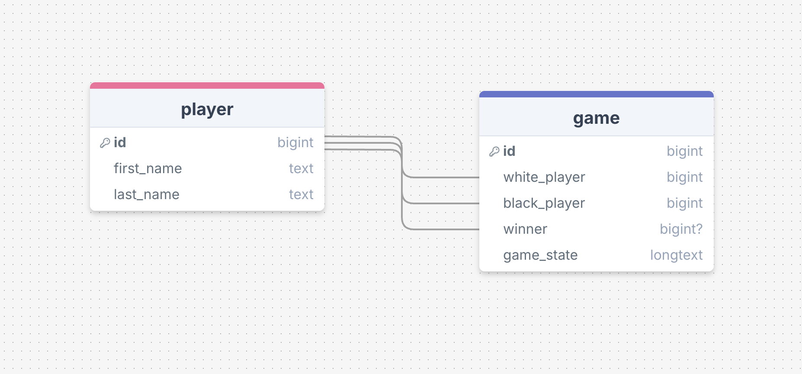

# wizards_chess

## Instructions
```
1. Summarize in words and pictures what your project purpose and goals are (other students will see this as well and it will help them quickly grasp the purpose of you project).

2. Sketch your initial thinking on your ERD and the data your project will be accessing and using

3. Sketch rough system design of your project, what are the technologies and pieces (shapes) and interactions (arrows)

4. Make initial goals for where you want your project to be at each day until the end of class.

5. Please include any additional relevant information you'd like to include or have. If you project has UX maybe you could have some rough sketch of that as well.
```
## Project Purpose and Goals
The purpose of this project is to build a wizards chess system that uses voice commands to move chess pieces on a chess board.

## Initial ERD and Data Design

The data will be simple. The game will have players, and the game will store a JSON string representing the game state.

## Rough System Design
Software Technologies: MySQL, speech to text libraries

Interactions: MySQL will store data generated by speech to text software, as well as game data.

## Initial Goals
Nov 8: Initial Plan and Research

Nov 15: Voice controlled movement

Nov 29: Basic hardware completed

Dec 6: Final integration and testing